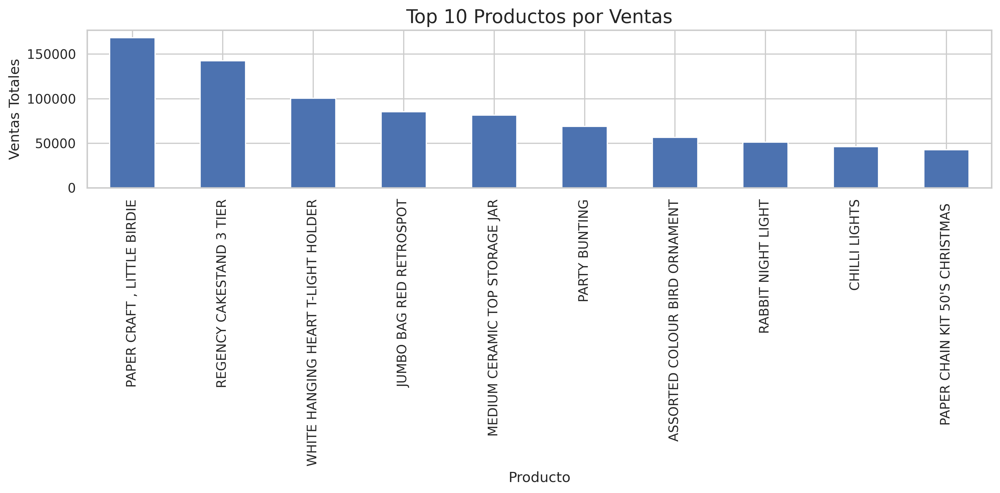
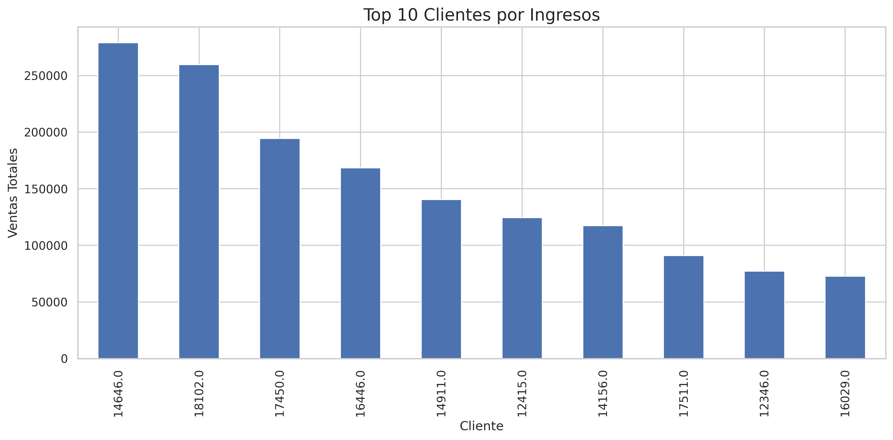
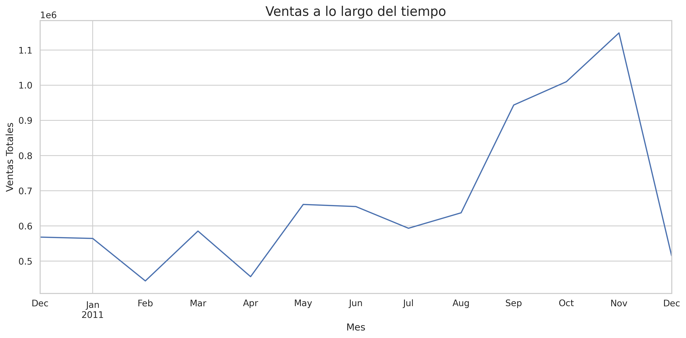

# 🛒 E-commerce Sales Analysis

## 📌 Project Overview
This project focuses on exploratory data analysis (EDA) using an e-commerce retail dataset.

The objective was to identify:
- Top-selling products
- High-value customers
- Sales trends over time
- Business opportunities through data analysis

---

## 🛠️ Tools & Technologies
- Python
- Pandas
- Matplotlib
- Seaborn

---

## 📊 Analysis Performed
- Data cleaning
- Revenue calculation
- Product sales analysis
- Customer segmentation
- Monthly sales trend analysis

---

## 📈 Visualizations

### Top Products by Sales

---

### Top Customers by Revenue

---

### Sales Trends Over Time

---

## 🔍 Key Insights
- Home decor and party products generated the highest revenue
- A small group of customers concentrated a significant percentage of sales
- Sales increased during the last quarter of the year, showing seasonal patterns

---

## 🚀 Author
Sonia Judith Galian
